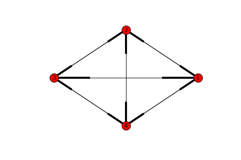

## Material transitions

In geodynamic simulations it is common to impose compositional / material changes during model evolution. An example is a creation (and destruction) of crust, which is often used to help decouple the thermal boundary layers, and hence allow them to subduct in a more realistic manner. The transition from one material type to another could be a function of any number of instantaneous or history depended system variables: depth, pressure, temperature, age, accumulated strain etc. 

In the Particle in Cell method, we track material composition with an advected particle swarm. In this tutorial, we assume that each material as a unique integer index which is stored in the particel. Compositional / material changes then amount to being able to query and update the material index of each particle in the swarm. 

In Underworld2, [functions](https://github.com/underworldcode/underworld2/blob/master/docs/user_guide/05_Functions.ipynb), along with conditionals (`fn.branching.conditional`) provide an easy way to track and update materials. 

## Functions

Here's a simple way to set the value of particles on a swarm:

```
Conditions = [(depthFn > 0.5, 2),
                (True, materialVariable)]

materialVariable.data[:] = fn.branching.conditional(Conditions).evaluate(swarm)
```


Often, a material transition depends not only on the current condition of th particle (depth, pressure, temperature, age, accumulated strain etc. ), but also on the _current_ material type of the particle. For instance, we might allow 'mantle' material to become 'crust', but not allow harzburgite to become crust. 

The following expression looks reasonable:

```
combinedConditions = (depthFn > 0.5) and (materialVariable == 1)
```

However, with Underworld2 functions, this type of equality comparison is not supported (because of the underlying c++ data types). We can instead use greater than / less than comparison:

```
dta = 1e-6 #small number
combinedConditions = (depthFn > 0.5) and \
                     (materialVariable > (1 - dta) ) and \
                     (materialVariable < (1 + dta) )
```

We can make also use of functional forms (in the regular Python sense of function) of the operators, provided by the [operator](https://docs.python.org/2/library/operator.html) package:

```
dta = 1e-6 #small number
indexCheck = operator.and_((materialVariable > (1 - dta) ), 
                           (materialVariable < (1 + dta) ))
             
combinedConditions = operator.and_((depthFn > 0.5) , indexCheck)
```


## Material graphs

A more structured way to represent a series of material transitions is through a directed graph. In such a graph, nodes represent different material types, edges (directed) represent all possible transitions that could occur. We then need to attach conditions to those edges, and then be able to query the graph for any particle, to determine if a material transition should take place.

The main advantage of this approach is simply that it provides a uniform way to store and access our material model. Depending on the complexity of the material model, it may also provide a clearer way of writing the conditions for material transition.

The code for material graph Class can be found in the example [notebook](https://github.com/dansand/materialTransformations/blob/master/material_transformations.ipynb).

Assuming we have defined the _MatGraph_ Class, here is the how we would build the graph object, with nodes representing each material's index:

```
#Materials
matname1 = 1
matname2 = 2
matname3 = 3
matname4 = 4

#list of all material indexes
material_list = [1,2,3,4]

#Setup the graph object
DG = MatGraph()

#add all the material types to the graph (i.e add nodes)
DG.add_nodes_from(material_list)
```

We can now visualise the graph...

```
import networkx as nx
nx.draw_circular(DG, with_labels=True)
plt.show()
```





Now the graph is set up, here is how we could can add conditions for the transition form one material to a another. For instance, given an Underworld2 function (depthFn) that returns the depth, we could specify that _matname1_ transforms to _matname2_ when the depth is less than 0.5:

```
DG.add_transition((matname1,matname2), depthFn, operator.lt, 0.5)
```

The first argument is a tuple expressing the possibiliy of a material transition from matname1 => matname2. Note that this transition is one way  (hence a directed graph); matname1 => matname2 does not imply matname2 => matname1.

The next three arguments are _function_, _operator_, _value_. The Docstring for the add_transition() method describes their meaning:

```
Parameters
        ----------
        nodes : Tuple
            (a,b) represents the possibility of a transition from material a to material b
        function: underworld.function._function.Function
            (could also be a constant)
        nOperator: operator
            operators must be provided in function form through the operator package, eg. operator.gt(1., 2.). Only less than and greater than operators are supported.
        value: float
            the value will be compared to the providided function, given the provided operator
        combineby: string
            'and' or 'or', defaults to 'and'. If multiple rules are provided for a single edge in the graph (representing the material transition)
            then they be applied in the sense of any ('or'), or all ('and')
```


## Multiple conditions

Multiple conditions can be attached to a graph edge. For instance, here we can set both depth and temperature constraints on the transition:

```
DG.add_transition((matname1,matname2), depthFn, operator.lt, 0.5, combineby = 'and')
DG.add_transition((matname1,matname2), temperatureField, operator.gt, 0.5, combineby = 'and')
```

If multiple rules are provided for a single edge in the graph (representing the material transition)  then they are applied in the sense of any condition must true ('or'), or all conditions must be true ('and'). The default is 'and'.


## Appying the conditions

Once the graph nodes, edges and conditions have been applied, the graph object can generate a list of condition which can be passed through to the Underworld2 fn.branching.conditional() function. 

```
DG.build_condition_list(materialVariable)

materialVariable.data[:] = fn.branching.conditional(DG.condition_list).evaluate(gSwarm)
```

Depending on the nature of the graph, there may be cases where multiple applications of the of fn.branching.conditional should be applied:

```
for i in range(2):
    materialVariable.data[:] = fn.branching.conditional(DG.condition_list).evaluate(gSwarm)
```


## Internal-consistency

No checks on the internal-consistenty of the material graph are provided. It is worth experimenting with swarm updates to make sure they are behaving as expected. 

